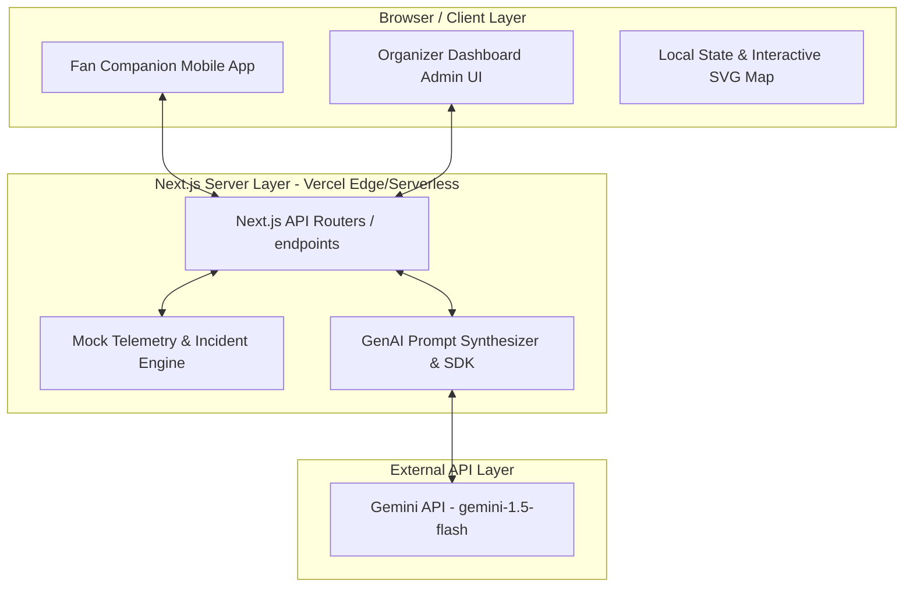
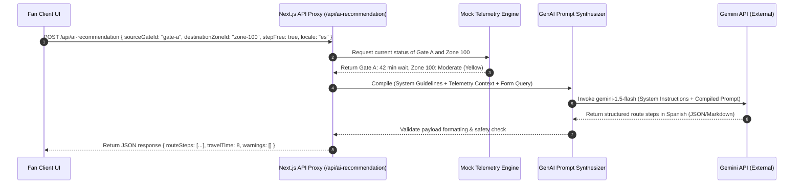
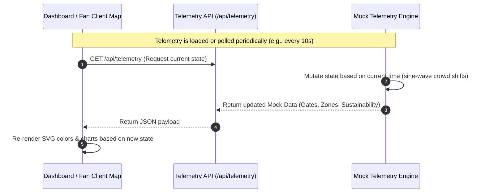
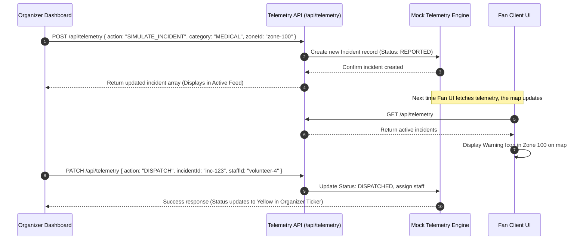

# System Architecture Document
## Project: StadiumSaathi
### Version: 1.0.0 (Hackathon MVP)
### Date: July 2026

---

## 1. High-Level System Architecture

StadiumSaathi is structured as a decoupled Next.js 14 App Router application optimized for deployment on an edge platform (Vercel) for the Hackathon MVP, with a clear path forward for containerized Google Cloud Run deployments. The system uses a strict backend proxy model to isolate clients from direct GenAI keys.



### Component Breakdown
*   **Client Layer**: Built as lightweight React components styled with Vanilla CSS. The map rendering runs entirely on the client using interactive inline SVGs to avoid expensive map-server dependencies.
*   **Next.js Server Layer**: Handles route requests and proxies external API calls. This layer hosts the APIs for telemetry, translation, and structured navigation recommendations, keeping the private `GEMINI_API_KEY` hidden from the client browser.
*   **Mock Telemetry & Incident Engine**: Since this is a hackathon MVP, we simulate real-time sensors, stadium queues, transit systems, and incident reports. The engine generates dynamic data structures that change periodically based on system time and user actions (e.g. simulating an incident).
*   **GenAI Prompt Synthesizer**: Compiles the current mock telemetry state, system security instructions, user source/destination coordinates, and accessibility preferences into a optimized context-rich prompt before invoking the Gemini API for structured navigation step-generation.

---

## 2. Dynamic Data Flows

This section details the operational sequences for structured AI navigation, real-time telemetry updates, and emergency/incident response systems implemented in the MVP.

### 2.1 AI Request Flow (Structured Navigation Recommendation)
This sequence shows how the fan selects starting locations and targets in the Navigation Advisor, which are augmented with live telemetry variables and translated into step-by-step route directions.



### 2.2 Real-time Data Flow (Mock Data Simulation)
To keep the dashboard and maps responsive, the client polls or fetches status updates which are driven by a time-based mock generator.



### 2.3 Incident Management Flow
This flow details how an incident is created (simulated), tracked, dispatched, and resolved in the platform.



---

## 3. Detailed API Specification (MVP Endpoints)

The MVP implements three serverless endpoints to power the application. All API payloads are formatted as JSON, and endpoints are located under `/api/`.

### 3.1 Get/Mutate Telemetry State
*   **Endpoint**: `/api/telemetry`
*   **Method**: `GET`
    *   **Description**: Retrieves the current state of all gates, zones, transit routes, active incidents, and sustainability stats.
    *   **Success Response (200 OK)**:
        ```json
        {
          "gates": [
            {
              "id": "gate-a",
              "name": "Gate A - North Plaza",
              "status": "OPEN",
              "currentWaitTimeMinutes": 42,
              "passengerFlowRate": 15,
              "accessible": true,
              "coordinates": { "x": 120, "y": 450 }
            }
          ],
          "zones": [
            {
              "id": "zone-100",
              "name": "Lower Bowl North",
              "occupancy": 8200,
              "capacity": 10000,
              "densityColor": "YELLOW",
              "stepFreeRoutesAvailable": true
            }
          ],
          "incidents": [],
          "transit": [
            {
              "id": "shuttle-downtown",
              "name": "Downtown Express Shuttle",
              "type": "SHUTTLE",
              "closestGateId": "gate-a",
              "nextDepartureMinutes": 8,
              "delayMinutes": 2,
              "status": "ON_TIME",
              "carbonOffsetKg": 1.2
            }
          ],
          "sustainability": {
            "recycleKg": 1420.5,
            "compostKg": 820.2,
            "landfillKg": 310.8,
            "carbonOffsetTotalKg": 5420.0,
            "fanParticipationRate": 78.5
          }
        }
        ```
*   **Method**: `POST`
    *   **Description**: Simulates/inserts a new incident or pushes a state override (e.g. closing a gate).
    *   **Request Body**:
        ```json
        {
          "action": "SIMULATE_INCIDENT",
          "category": "MEDICAL",
          "description": "Dehydration reported at Sector 112",
          "zoneId": "zone-100"
        }
        ```
    *   **Success Response (201 Created)**:
        ```json
        {
          "status": "success",
          "incident": {
            "id": "inc-9827",
            "category": "MEDICAL",
            "title": "Medical: Dehydration",
            "description": "Dehydration reported at Sector 112",
            "severity": "HIGH",
            "status": "REPORTED",
            "location": {
              "zoneId": "zone-100",
              "section": "Sector 112",
              "coordinates": { "x": 150, "y": 320 }
            },
            "reportedAt": "2026-07-07T10:45:00.000Z"
          }
        }
        ```
*   **Method**: `PATCH`
    *   **Description**: Updates an incident's dispatch status.
    *   **Request Body**:
        ```json
        {
          "action": "DISPATCH",
          "incidentId": "inc-9827",
          "assignedStaffId": "staff-02"
        }
        ```
    *   **Success Response (200 OK)**:
        ```json
        {
          "status": "success",
          "incidentId": "inc-9827",
          "newStatus": "DISPATCHED",
          "dispatchedAt": "2026-07-07T10:46:12.000Z"
        }
        ```
*   **Error Codes**:
    *   `400 Bad Request`: Missing or invalid fields.
        ```json
        { "error": "Invalid action parameter. Must be SIMULATE_INCIDENT or DISPATCH." }
        ```
    *   `404 Not Found`: Incident ID not found.

---

### 3.2 AI Navigation Recommendation
*   **Endpoint**: `/api/ai-recommendation`
*   **Method**: `POST`
    *   **Description**: Receives source, destination, and accessibility preferences. Integrates live queue telemetry and queries Gemini for step-by-step route directions.
    *   **Request Body**:
        ```json
        {
          "sourceGateId": "gate-a",
          "destinationZoneId": "zone-100",
          "stepFreeRequired": true,
          "sensorySafeRequired": false,
          "locale": "es"
        }
        ```
    *   **Success Response (200 OK)**:
        ```json
        {
          "routeSteps": [
            "Ingrese por la Puerta A (tiempo de espera actual: 42 minutos).",
            "Siga el pasillo de la derecha evitando las escaleras.",
            "Tome el ascensor 3 para subir al nivel de la Concha Concursal.",
            "Gire a la izquierda en la señalización verde y continúe hasta la Zona 100."
          ],
          "estimatedTravelTimeMinutes": 12,
          "warnings": [
            "Congestión moderada detectada en el pasillo norte principal."
          ]
        }
        ```
*   **Error Codes**:
    *   `400 Bad Request`: Invalid request parameters or parameter too long.
    *   `500 Internal Server Error`: Gemini API lookup failed.
        ```json
        { "error": "AI service is temporarily unavailable. Returning default static routing." }
        ```

---

### 3.3 Translation Service
*   **Endpoint**: `/api/translate`
*   **Method**: `POST`
    *   **Description**: Translates dynamic signs, custom broadcast messages, or notices.
    *   **Request Body**:
        ```json
        {
          "text": "Please remain seated. A maintenance team is clearing a spill in Concourse B.",
          "targetLocale": "es"
        }
        ```
    *   **Success Response (200 OK)**:
        ```json
        {
          "translatedText": "Por favor, permanezcan en sus asientos. Un equipo de mantenimiento está limpiando un derrame en el Convestíbulo B."
        }
        ```
*   **Error Codes**:
    *   `400 Bad Request`: Message parameter too long (> 500 characters) or missing fields.
    *   `500 Internal Server Error`: Translation service failed.

---

## 4. Prompt Synthesis Blueprint

To generate precise step-by-step navigation advice without general conversational chat, the server compiles structured form options alongside live telemetry variables.

### Prompt Compilation Function (Server-Side)
```typescript
// app/api/ai-recommendation/promptCompiler.ts
import { Gate, Incident, Zone, NavigationRequest } from "@/docs/interfaces";

interface TelemetryContext {
  gates: Gate[];
  zones: Zone[];
  activeIncidents: Incident[];
}

export function compileNavigationPrompt(req: NavigationRequest, context: TelemetryContext): string {
  // 1. Resolve selected nodes
  const sourceGate = context.gates.find(g => g.id === req.sourceGateId);
  const targetZone = context.zones.find(z => z.id === req.destinationZoneId);

  // 2. Format localized warnings and constraints
  const accessibilityConstraint = req.stepFreeRequired 
    ? "REQUIREMENT: The path MUST be step-free. Do not suggest stairs or escalators. Guide them through elevators."
    : "Constraint: Standard routes allowed.";

  // 3. Serialize general telemetry variables
  const activeAlerts = context.activeIncidents
    .map(i => `- Incident: ${i.title} in ${i.location.zoneId} (Severity: ${i.severity})`)
    .join("\n") || "No active safety bottlenecks.";

  // 4. Return compiled context with rigid formatting and safety instructions
  return `
You are StadiumSaathi, the official, highly accessible AI Navigation Advisor for the FIFA World Cup 2026.
You generate structured step-by-step navigation instructions.

--- VENUE CONTEXT & TELEMETRY ---
Source Gate: ${sourceGate ? `${sourceGate.name} (Wait time: ${sourceGate.currentWaitTimeMinutes} mins)` : "Unknown Gate"}
Destination Zone: ${targetZone ? `${targetZone.name} (Current Occupancy: ${targetZone.occupancy})` : "Unknown Zone"}
Locale: "${req.locale}"

ACCESSIBILITY MODE:
${accessibilityConstraint}

ACTIVE WARNINGS & HAZARDS:
${activeAlerts}

--- SYSTEM DIRECTIONS ---
1. Analyze the wait times and warning hazards. If there is a spill or congestion in the destination zone or pathway, add a warnings entry.
2. Provide a list of 3-5 logical, step-by-step directions to walk from the Source Gate to the Destination Zone.
3. Keep each step brief and clear. Do not speak in conversational dialogue.
4. Translate all directions and labels completely to locale "${req.locale}".
5. Return instructions in a structured markdown checklist or numbered steps.

Provide the response in clear Markdown formatting.
`;
}
```

---

## 5. Future Production Architecture & Migration Path

Transitioning the hackathon MVP into an enterprise-grade multi-stadium production environment requires migrating from edge hosting to a structured Google Cloud Platform (GCP) layout.

```
                         PRODUCTION CLOUD ARCHITECTURE
 ┌────────────────────────────────────────────────────────────────────────┐
 │                        Google Cloud Platform                           │
 │                                                                        │
 │  ┌─────────────────┐       ┌─────────────────┐       ┌──────────────┐  │
 │  │   Cloud Armor   ├──────>│ Global Load Bal ├──────>│  Cloud Run   │  │
 │  │      (WAF)      │       │     (HTTPS)     │       │ (Containers) │  │
 │  └─────────────────┘       └─────────────────┘       └──────┬───────┘  │
 │                                                             │          │
 │                                      ┌──────────────────────┴──────┐   │
 │                                      ▼                             ▼   │
 │                              ┌──────────────┐              ┌──────────────┐  │
 │                              │  Cloud SQL   │              │  Firestore   │  │
 │                              │ (PostgreSQL) │              │  (NoSQL DB)  │  │
 │                              └──────────────┘              └──────────────┘  │
 └────────────────────────────────────────────────────────────────────────┘
```

### 5.1 Infrastructure Migration
*   **Containerization**: Wrap the Next.js application in a multi-stage Docker configuration.
*   **Google Cloud Run**: Deploy containers to Cloud Run with auto-scaling (0 to 1000+ instances) configured to handle pre-match and post-match traffic spikes.
*   **Global Load Balancing**: Configure a Google Cloud HTTP(S) Load Balancer in front of Cloud Run to direct fan traffic to the closest regional cluster (e.g. US-East, Mexico-Central, Canada-East) reducing latency.

### 5.2 Real-time Infrastructure & DB Migration
*   **SQL Database (Cloud SQL PostgreSQL)**: Migrate Gates, Zones, Concessions, and User roles to a managed PostgreSQL cluster. Use indexing on `location_id` and `zone_id`.
*   **NoSQL Database (Firestore)**: Store user interaction logs and live coordinates, allowing rapid updates without locks on relational tables.
*   **Real-time Event Messaging**: Implement a WebSocket gateway using Google Cloud Pub/Sub and Socket.io. When a sensor triggers a crowd surge or an organizer logs an incident:
    1.  The event publishes to a Pub/Sub topic.
    2.  A worker service pushes the event down the active WebSocket connection to all connected Fan maps.
    3.  The client maps update instantly without polling `/api/telemetry`.

### 5.3 CI/CD Deployment Flow
Deployments will follow a GitOps workflow managed by Google Cloud Build:
1.  **Commit**: Developers push code to the `main` branch.
2.  **Verify**: GitHub Actions runs a comprehensive CI suite (Unit tests, Lints, SonarQube vulnerability scanning, WCAG visual check).
3.  **Build**: Cloud Build packages the repository into a secure Docker image.
4.  **Register**: The image is uploaded to Google Artifact Registry (GAR) with SHA tags.
5.  **Deploy**: Cloud Build triggers a rolling update to Google Cloud Run, using traffic-splitting (e.g. 95% to current, 5% to new) for canary validation.
